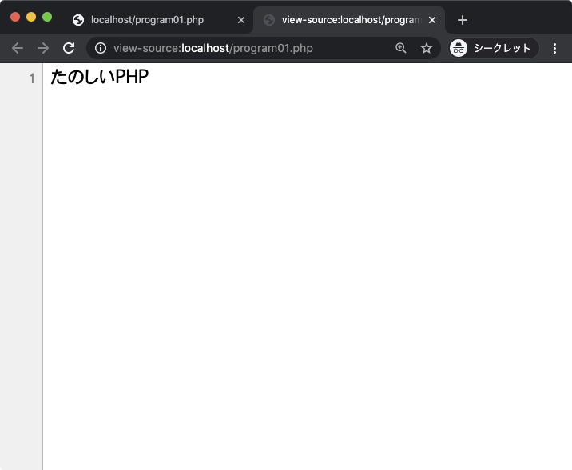

[chapter]

# 最初の一歩

プログラムは思ったようには動かない。書いた通りに動く。

  — プログラマに伝わる格言

 

##  PHP のプログラムの書き方

  最初に PHP を使用したプログラムの書き方、動かし方を学びましょう。 簡単なプログラムを作成しながら手順を確認します。

##  環境の確認
  まずは、XAMPP が起動していて、Apache が Running の状態になっていることを確認してください。
  Web ブラウザで http://localhost/ にアクセスして、XAMPPのページが表示されるか 確認しても良いでしょう。

## ファイル作成

  テキストエディタを開いて、ファイルを新規作成します。プログラムを実際に書くまえに、名前を付けて保存しましょう。
  
[sn:R-9,htdocs,XAMPP をインストールしたxamppフォルダの中のhtdocsフォルダを xampp/htdocs と表記します。]

  保存するフォルダは **xampp/htdocs**[sn:htdocs]です。 ファイル名は "program01.php" とします[sn:encode]。PHP のプログラムを含むファイルの拡張子は .php にしないとプログラムとして動作しません。
  
[sn:R-5,encode,保存時の文字エンコーディングは原則として UTF-8:BOM なしにします。 以降の実習ではファイルは全て UTF-8:BOM なしで保存してください。文字エンコーディングを指定する方法はエディタによって異なります。]

## プログラム記述

 PHP のプログラムは &lt;?php プログラム本体 ?&gt; という書式で記述します。&lt;?php から ?&gt; までを PHP タグと呼びます。 <?php の後には必ず1つ以上の空白(半角スペース,TAB,改行のどれか)を入れてください。
 
 また、必須ではありませんが、?> の前 にも空白を入れるようにします。 文字列やコメントなど一部を除いて、半角英数字、記号で記述します。俗に言う全角文字があるとエラーになります。

 では、以上の点に注意して次のプログラムを入力してください。
  
[src:program01.php]

## プログラムを実行する

JavaScript で記述したプログラムであれば、ファイルをWebブラウザで開くだけで実行できます。しかしPHPで記述したプログラムはそうはいきません。

繰り返しになりますが、PHPはサーバサイドプログラム言語です。基本的にWebサーバを通じてファイルにアクセスしないと、プログラムは実行されません。

Webブラウザを開いて、http://localhost/program01.php にアクセスしてみてください。

**program01.phpをブラウザにドラッグ&ドロップをして表示させてはいけません。**Webブラウザには直接PHPのプログラムを実行する能力はないのでPHPのプログラムは動きません。

[newpage]

きちんと"はじめてのPHP"と表示されたでしょうか[sn:decode_miss]。

[sn:R+0,decode_miss,Internet Explorer や Chrome の古いバージョンでアクセスすると、この作例では文字化けして表示が崩れることがあります。文字化けした場合は「文字エンコーディング」を変更することで表示を直すことができます。]

## 意図した通りに動かない場合 

もしも正しく表示されない場合は次の点に注意してプログラムを見直してみてください。

* Web サーバを通してアクセスしているか
  → http://localhost/program01.php にアクセス
* プログラム中に全角半角文字が混在していないか
* PHP タグの中に記述しているか
* &lt;?php の後に半角スペース ( または改行 ) を正しく記述しているか
* 括弧( ) {} []が正しく対応しているか
* "( ダブルクォーテーション )、'( シングルクォーテーション ) が正しく対応しているか 
* 文の最後に ;( セミコロン ) を付け忘れていないか

また、Webブラウザに何らかのエラーメッセージが表示されている場合はほとんどの場合行番号が表示されています。その行の近辺でエラーになっている可能性が高いので重点的にチェックしてみて下さい。

## 実験:Webブラウザで"ソースを見る"

ここでひとつ、PHPがサーバサイドプログラムであるという点を実験で確認してみましょう。
さきほどのprogram01.phpをWebブラウザで表示している状態 (http://localhost/ program01.php) でページ上を右クリックして、

* Firefox、Chrome、Safari...「ページのソースを表示」
* InternetExplorer...「ソースの表示」

を選択します。
すると、Webページを構成するHTMLが表示されます。

JavaScriptであればページのソースを表示するとプログラムがそのまま表示されるのですが、PHPではプログラムが実行された結果しか表示されません。
この結果からわかるようにユーザからはそのWebページがPHPで作られたものかどうかは判別できないのです。
