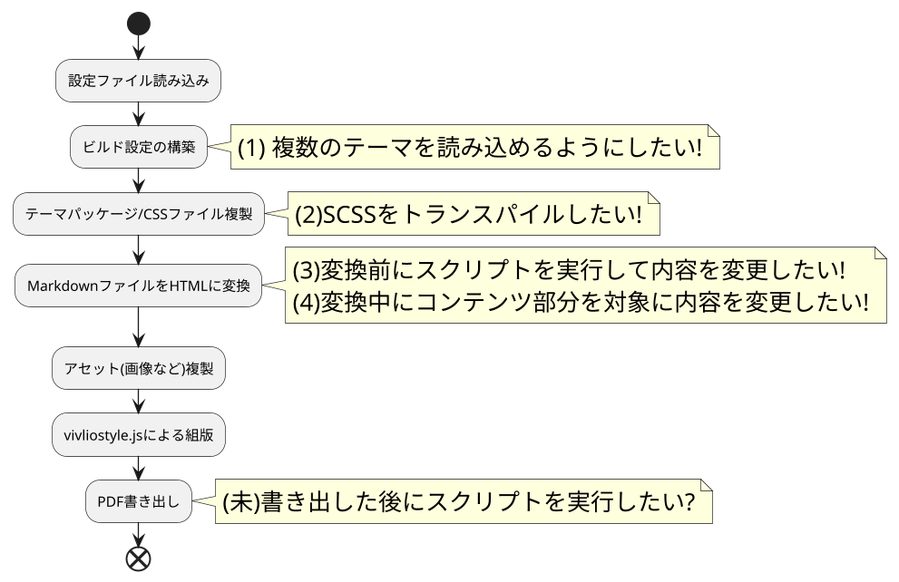
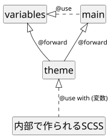

# Vivliostyle-cliへの新機能の提案

## 高井 歩
## twitter: @AyumuTakai

<p style="text-align: center">
使用テーマ: @vivliostyle/theme-slide + カスタムテーマ
</p>

# 本日の内容

* 自己紹介
  * Vivliostyleを選んだ理由
  * Vivliostyleで良かったこと/残念だったこと
* 新機能の提案と利用例
  * 複数テーマの適用
  * SCSSトランスパイル機能
  * コンテンツの置換機能
  * プリプロセス機能

[comment]

* 質問/要望/困りごとがあるなら
  * Slackのチャンネルに参加
  * Twitterで呟く
  * 自分でなんとかする

[/comment]

# 自己紹介

普段は専門学校などで情報処理系の講師をしています。

授業で使用する資料を作成することが多く、カリキュラムや進捗に合わせて細かく差し替えや改訂が必要です。

Vivliostyleに出会う前はAdobe InDesignで資料を作成していました。<span style="color:lightgray">(現在は脱税済)</span>

# VivlioStyleを選んだ理由

Vivliostyleに関わるようになった切掛けは、講義資料を作るのにカスタマイズが容易なDTP環境が欲しかったため。

* UML図やソースコードの埋め込みに手間が掛り修正ミスが多発するので自動化したい。
* TeX系の環境も複数検討したが、カスタマイズの難易度が高く原稿の締め切りに間に合いそうにない。

HTML/CSS/JavaScriptは普段から使っているのでVivliostyleならカスタマイズが楽だろうと思った(伏線)

# VivlioStyleを使って良かったこと

* 章単位での差し替えが楽。
* テキストベースで修正が楽になり原稿を再利用しやすい。
* レイアウト等を統一しやすい。
* 原稿の量が増えても修正が軽い。

InDesignを使いこなせていなかっただけとも。

# Vivliostyleを使って残念だったこと

カスタマイズの余地が少ない(伏線回収)  

標準のスクリプト/マクロ実行の仕組みが無いため、Vivliostyleのシステム外で処理が必要になってしまう。

<ul style="list-style-type: none; border: solid 1pt gray; border-radius: 1em;padding:1em;">
<li>→ Vivliostyle-cliはTypeScript製で読み書きできる。</li>
<li>→ なら自分で改造してしまえば良いのでは。</li>
<li>→ 欲しい機能を追加した"自家用版"を作成。</li>
<li>→ 作ってみたら思ったより有用なので本家に還元したい。</li>
</ul>

# 新機能の概要



<small>
※ 自家用版では処理の順番が本家と異なります。
</small>

# 提案1 複数のテーマを読み込めるようにしたい

複数のテーマを各コンテンツに重ねて適用できるようにします。

## 利点

* 既存テーマのfork/clone不要でカスタマイズしやすい
* 元テーマの更新にカスタマイズ側で対応しやすい
* 原稿に合わせてテーマを着脱しやすい
* 部分的なテーマを組合せることで新しいテーマを作りやすい

## 課題

* 構造の複雑化によって適用されるスタイルを想像しにくい
* テーマの相性問題が発生しやすくなる


# 提案1.1 複数のテーマの指定方法(書式検討中)

JavaScriptの配列の形で複数のテーマ/CSSを列挙します。

```javascript:vivliostyle.config.js
{  /* 省略 */
  theme: ['@vivliostyle/theme-slide','./custome-theme'], /* 全体に適用されるテーマ */
  entry: [
    'manuscript01.md',
    { 
      path: 'manuscript02.md',
      theme: [
        '@vivliostyle/theme-slide', /* テーマの継承は未実装なので全体テーマも指定 */
        './custom-theme',
        './sub-theme.css' /* このエントリにだけ適用されるテーマ */
      ]
    }
  ]
}
```

<small>
※ 全体テーマをエントリに継承するルールを検討中です
</small>

# 提案1.2 複数のテーマを指定した結果

テーマは指定した順番でHTMLにlink要素で書き出され、スタイル指定が各CSSファイルで被った場合はCSSのルールに従って要素のスタイルが決まります。

```html:manuscript01.html
...省略...
<!-- エントリごとのテーマ指定が無いため、全体テーマが適用されます -->
<link type="text/css" rel="stylesheet" href=".vivliostyle/themes/packages/@vivliostyle/thme-slide/theme.css">
<link type="text/css" rel="stylesheet" href=".vivliostyle/themes/packages/custome-theme/theme.css">
...省略...
```

```html:manuscript02.html
...省略...
<!-- エントリに指定したテーマが適用されます -->
<link type="text/css" rel="stylesheet" href=".vivliostyle/themes/packages/@vivliostyle/thme-slide/theme.css">
<link type="text/css" rel="stylesheet" href=".vivliostyle/themes/packages/custome-theme/theme.css">
<link type="text/css" rel="stylesheet" href=".vivliostyle/themes/sub-theme.css">
...省略...
```

# 提案1.3 複数テーマ指定 デモ

<div style="min-height: 70%;">

以下のテーマを順に適用します。

* A4書籍用ページレイアウト(ページ余白、ノンブル、柱の設定)
* 表紙用テーマ(ページ背景を設定、ノンブルと柱を非表示)
* 2段組みテーマ

</div>

# 提案2 SCSSをトランスパイルしたい

SCSSファイルのトランスパイルをビルド中に行ないます。また、設定ファイルからSCSS変数の値を指定できるようになります。

## 利点

* 事前にSCSSをトランスパイルする必要が無くなる
* 変数によってテーマのカスタマイズの範囲がひろがる
* 変数と条件分岐を使ってスタイル指定を切り替えられる

## 課題

* SCSSトランスパイルの結果が想定しにくい
* 変数や各種構文を使うとテーマの作成難易度が高い

# 提案2.1 SCSSと変数の指定方法

<div style="width: 100%; min-height: 60%; overflow: hidden;">

<div style="float:left; width:48%;">

```scss:variables.scss
$color: black !default;
$backgroundColor: cyan !default;
```

```scss:main.scss
@use "variables" as *;
h1 {
  color: $color;
  background-color: $backgronudColor;
}
```

```scss:theme.scss
@forward "variables";
@forward "main";
```

```javascript:vivliostyle.config.js
theme: theme.scss,
vars: { color: red; } // $colorを上書き
```
</div>

<div style="float:right; width:48%;">

```scss:vivliostyle-cliの内部で作成されるscss
@use 'theme.scss' with (
  $color: red;
)
```

<p style="font-size: 0.8em;">各ファイルの依存関係</p>
<div style="text-align: center;">



</div>

```css:処理結果(theme.cssとして書き出し)
h1 {
  color: red; /* 上書きされた */
  background-color: cyan; /* そのまま */
}
```
</div>

</div>

# 提案2.2  SCSSトランスパイル デモ

<div style="min-height: 70%;">

SCSSと変数を使ってテーマに以下の機能を追加しています。

* 文字サイズ、行送りのカスタマイズ
* 開始ページ番号指定
* 表紙だけに適用されるスタイル
* レイアウトガイドの表示

</div>

# 提案3 Markdown変換前にスクリプトを実行したい

プリプロセス機能として、Markdownファイルに対する前処理をJavaScriptで記述することができます。

## 利点

* 特定用途向けの事前処理を比較的簡単に実装できる
* 複数の行を対象に処理を行なえる

## 課題

* Node.jsに関する知識が必要になる
* 独自にMarkdown変換処理が必要になることもある

# 提案3.1 スクリプト記述

<div style="min-height: 70%;">

テキスト(コンテンツ)を受取りテキストを返す関数を作成します。

```javascript:script.js
exports.preprocess = (filepath, contents)=>{
  contents = contents.replace("ビブリオスタイル","Vivliostyle");
  return contents;
};
```

テーマには複数のスクリプトを持たせられます。

```javascript:package.json(部分)
scripts:['script.js','script2.js','script3.js']
```

プリプロセス関数は連結され順番に実行されます。

<div style="text-align: center;">


</div>

<small>
※ プリプロセス関数に与えられる引数やエラーハンドリングなどの仕様を検討中です。
</small>

</div>

# 提案3.2 プラグインの記述例

Markdown中のデータをもとにグラフ画像を埋め込むプラグインの例です。記述するのはたったこれだけです。

```javascript:script.js
exports.preprocess = async (filename,contents)=>{
  const ChartJsImage = require('chartjs-to-image');
  const pattern = /\`\`\`json:#!chart$([\s\S]*)+\`\`\`$/gm;
  const configJson = pattern.exec(contents);
  if(configJson && configJson.length > 0) {
    const config = JSON.parse(`${configJson[1]}`);
    const myChart = new ChartJsImage();
    myChart.setConfig(config).setWidth(500).setHeight(500).setFormat("svg").setDevicePixelRatio(10);
    const chart = await myChart.toDataUrl();
    // svgでもpngのMIME-Typeで書き出されるので置換
    const svg = chart.replace("image/png","image/svg+xml");
    const width = config.width ? `width: ${config.width}` : "";
    contents = contents.replace(pattern,``);
  }
  return contents;
};
```

# 提案3.3 プリプロセス デモ

<div style="min-height:70%;">

プリプロセス機能を利用して作成したプラグインを紹介します。

* 複数行に渡る独自タグの置換
  * PlantUMLライブラリを利用したUML図の埋め込み
  * Chart.jsライブラリを利用したグラフの埋め込み
* TextLintライブラリによる文章校正
* OpenJTalkライブラリを利用した音声合成
* 帳票の作成

豊富なnpmパッケージを利用して簡単にプラグインを作れます。

</div>


# 提案4 Markdown変換中に内容を置換したい

Markdownファイルを変換中にコンテンツを置換できます。VFMのもつリプレイス機能を使用しています。

## 利点

* プリプロセスに比べ記述にパターンがあり作成が簡単
* 対象がコンテンツのみなのでタグなどを取り除く必要がない

## 課題

* 複数行にまたがる処理はできない
* HTMLの文字列要素を取り出すため、ルビなどがあるとコンテンツが分断される

# 提案4.1 リプレイス機能 記述例

単純な置換なら以下のようにとても簡単に記述できます。もちろん、正規表現を使った高度な置換処理も行なえます。

```javascript:script.js
exports.replaces = [
  {
    test: /猫/g,
    match: ([], h) => {
      return h("span","🐈");
    }
  },
  {
    test: /掌/g,
    match: ([], h) => {
      return h("span","🖐");
    }
  },
];
```

# 提案4.2 リプレイス機能 デモ

<div style="min-height: 70%;">

リプレイス機能を使った例を紹介します。

* コンテンツの単純な置換
* 独自タグ(傍注)
* 独自タグ(ファイルを読み込んで行番号付きで埋め込み)

</div>

# 提案のまとめと進捗

|   |  提案  | 現状   |
|---|---|---|
| 1 | 複数テーマの適用|基本機能をまずはPRする|
| 2 | SCSSトランスパイル | 詳細仕様検討中 |
| 3 | プリプロセス | 詳細仕様検討中 |
| 4 | コンテンツの置換 | ほぼ仕様確定なのでPRする |

授業資料を作成しながら必要になった機能を実装しているため、本家への還元がなかなか進んでいません。
仕様が決まって動作確認できた機能から還元していきますので、しばらくお待ちください。

# 最後に

* 帳票作成機能
* テーマを簡単にカスタマイズする仕組み(複数テーマの適用)

については、Twitterで見掛けたつぶやきが作成のきっかけになりました。

要望や問題があればつぶやいたりVivliostyleのSlackに参加してみてください。

[comment]

# 不具合を報告するとかなり迅速に対応してくれるよ。

* @page:nth()のページカウンタの事例


背景画像
https://bggenerator.com/index.php


※ ここで言うカスタマイズは紙面デザインではなく、スクリプト/マクロによる作業の自動化を指します。

## 当初の要件

* 受講生が使いやすいテキストのレイアウト(ページ小口側にメモ欄と傍注)を実現したい。
* スケジュールや進捗、講義で扱うソフトウェア環境に応じて扱う内容を柔軟に差し替えたい。
* UML図やプログラムのソースコードを簡単に埋め込みたい(元ファイルを編集したら自動で反映して欲しい)。

# 欲しい機能があれば作ってみるのもおもしろいよ。

* 自分がVivlioStyleに関わる切掛け
* 自家用版の開発を始める

# 自分用の機能でも本家に還元すると楽になるよ。

* 本家がバージョンアップするたびに自家用も更新するのは大変だよ。
* 新機能の還元方法。自分の場合。
    * Twitterでつぶやく。反応が無ければニーズが無いか、アピールすべき利点が伝わっていないか。
    * 開発者ミーティングに参加する。デモをしてみる。
    * Issueを立てる/プルリクを投げる


# VivlioStyleに関わるようになった切掛け

## 傍注が使いたい

本業では専門学校などでプログラミングの講師をしている。

これまでテキストや資料を自作する際にInDesigenを使用していたが自分の用途ではあまり有効に使い熟せていなかった。>脱税しました。

以下の要件を実現したかった。

* 受講生がメモを取りやすいように余白を大きめに取りたい。
* 用語の注釈は用語の近くに置きたい。

つまり傍注が使いたい。

他にも、

* スケジュールや進捗に応じて扱う内容を簡単に差し替えたい。
* UML図やプログラムのソースコードを簡単に埋め込みたい。

を実現したかった。

TeXを組版エンジンに使用するいくつかのソリューションを検討したが、傍注を実現するのに労力が必要だった。

VivlioStyleなら普段使っているHTML/CSS+JavaScriptでプログラミングすれば要件を実現できるのでは。


[/comment]